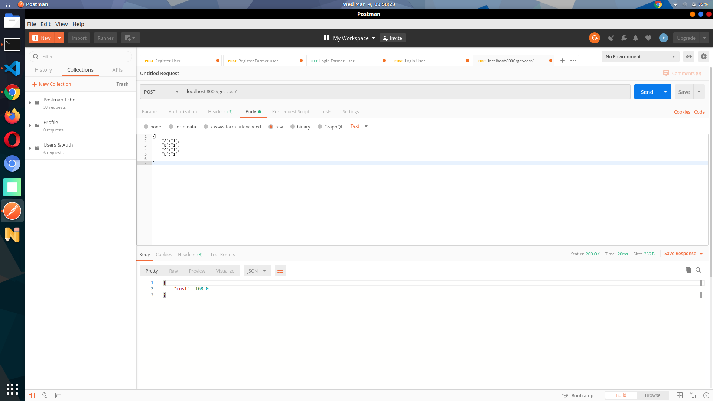

# Delivery-assignment


### Api endpoints

   <table>
   	<tr>
   		<th>S.No.</th>
   		<th>Route</th>
   		<th>Method</th>
   		<th>Access</th>
   		<th>Description</th>
   	</tr>	
	<tr>
   	   <td>5.</td>
           <td>localhost:8000/get-cost/</td>
           <td>POST</td>
           <td>Public</td>
           <td>return minimum cost</td>
   	</tr>
   </table>


```
Add raw data as an input :
{
	"A":"1",
	"B":"1",
	"C":"1",
	"D":"1"

}
```
```
output : 
{
    "cost": 168.0
}
```

### demo
    <br>
